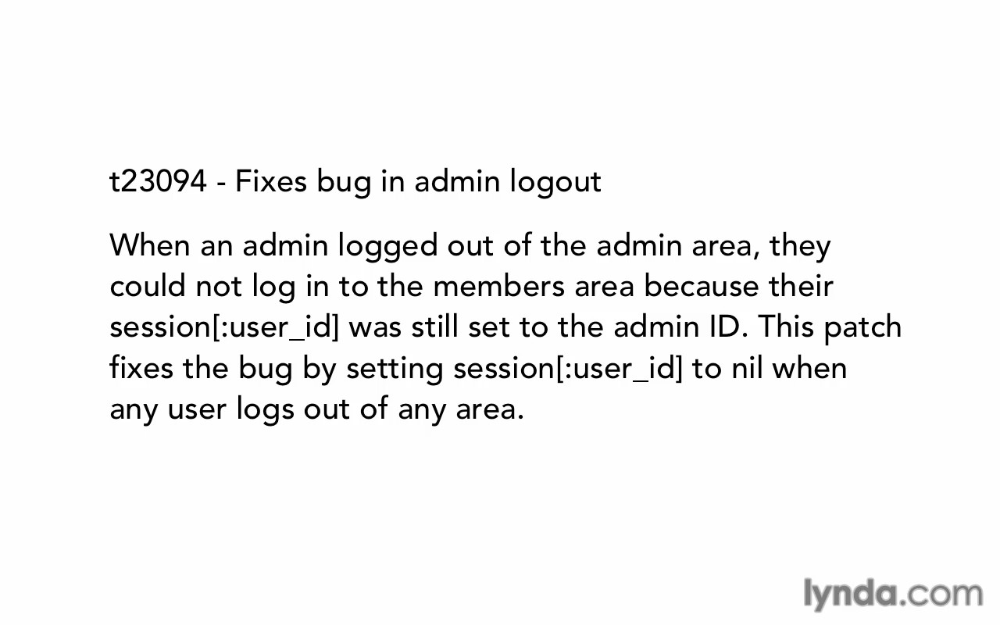
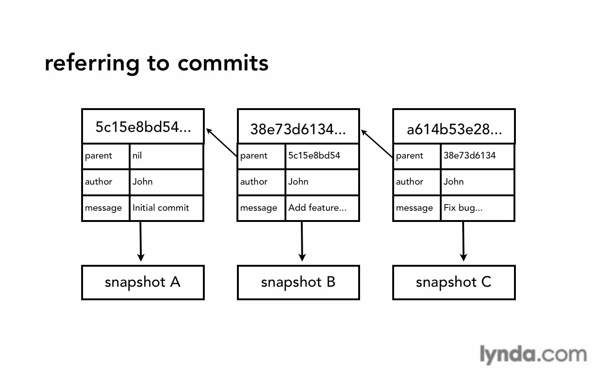

* First chapter (Installing Git)
    * [Git configuration](#git-configuration)
        * [Add/show your confg](#addshow-your-confg)
    * [Git help](#git-help)
* Chapter two (Getting Started)
    * [Git initializing](#git-initializing)
    * [First commit](#first-commit)
    * [Commit message best practices](#commit-message-best-practices)
    * [Git log](#git-log)
* Chapter three (Git Concepts and Architecture)
    * [How git save commits (Architecture)](#how-git-save-commits-architecture)
    * [HEAD pointer](#head-pointer)
* Chapter four (Making Changes to Files)
    * [Adding files](#adding-files)
    * [Viewing changes](#viewing-changes)
    * [Deleting files](#deleting-files)
    * [Moving / renaming files](#moving--renaming-files)

# Installing Git

## Git configuration:
System
```bash
git config --system
```
User
```bash
git config --global
```
Project
```bash
git config
```
## Add/show your confg:
```bash
git config --global user.name "bla bla bla"
git config --global user.email "bla@bla.bla"
```
To show current confgs.
```bash
git config --list
Or
git config user.name
```
To show messages on specific editor.
```bash
git config --global core.editor "bla bla bla"
```
To color terminal.
```bash
git config --global color.ui true
```
## Git help:
```bash
git help
```
To show specific command manual.
```bash
git help log
```

# Getting Started

## Git initializing
```bash
git init
```
## First commit
First you need add all changes you did on stage area.
```bash
# . for current directory.
git add .
```
After that commit them.
```bash
# -m for massage.
git commit -m "My first commit"
```
HOORAY your first commit is done.

## Commit Message best practices
Those are some point you need to be aware about them when you write a message.
* short single-line summary (less 50 characters).
* optionally followed by a blank line and more complete description.
* keep each line to less then 72 characters.
* write commit message in present tense.
* bullet points are usually asterisks or hyphens.
* can add (ticket tracking numbers) from bugs or support requests.
    * [css,js] for file type.
    * [bugFix] when you fix a bugs.
    * [#49443] ticket number for bugs or support.
Example for a good commit message.


## Git log
To show all log commits.
```bash
git log
```
To show last two or there or last commits.
```bash
git log -n 2 # for last two commit
```
Show commits from specific date.
```bash
git log --since=2018-05-10
```
Show commits before specific date.
```bash
git log --until=2018-05-10
```
Show commits for specific author (you can put only part form his name).
```bash
git log --author="bla"
```
Log by searching using regular expression on commit messages.
```bash
git log --grep="bla bla bla"
```

# Git Concepts and Architecture

## How git save commits (Architecture)


## HEAD pointer
Pointer to "tip" of current branch in repo.

Git save HEAD pointer on .git/HEAD file, and from this file it'll navigate you to the commit it refer on it.

# Making Changes to Files

## Adding files
* Any new files git doesn't know about them, will show them in (Untracked files).
```bash
git add file_name.txt
# or
git add . # dot for current directory
# or
git add file_* # * for any files begin with (file_)
```

## Viewing changes
We can compare between the changes in working directory and last changes in stage & repo.
```bash
git diff
```
Or changes on specific file.
```bash
git diff file_name.txt
```
For show changes on the stage area against repo use following command.
```bash
git diff --staged
```
## Deleting files
Just press delete or drag and drop files on trash :), To add removed file to stage area use following command.
```bash
git rm deleted_file.txt
```
> With new git versions you can simply use (git add).
OR short the holy steps by only use (git rm) to do both things delete the files and put them in stage area.

## Moving / renaming files
We can renaming any file by regular operation, rename the file with OS. And It'll show on git there's a file deleted and another added.
Or we can use git to short the process.
```bash
git mv old_file_name.txt new_file_name.txt
```
Same thing for moving files.
> On moving case It'll show moving process as a renaming process!
