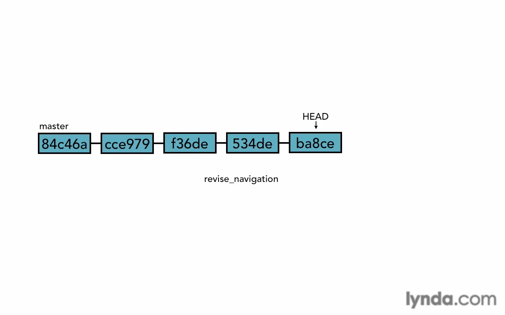

# Merging Branches

* [Merging](#merging)
* [Fast forward vs real](#fast-forward-vs-real)
* [Merge conflicts](#merge-conflicts)

## Merging
Now after we test our feature and it succeeded, we need to **mrege** it. <br>
Checkout the branch you want merge **to**, in this case master branch and type.
```bash
git merge feature_branch
```

## Fast forward vs real
**Fast forward merge** <br>
If you add some new commits on your feature branch and It be forward your master branch, and your master branch didn't move, in this case the fast forward merge will happened, it only takes a new commits and put master HEAD pointer on last commit and that's it!.




> In fast forward merge it doesn't create a merge commit, if you need a merge commit use <code>--no-ff</code> option, this commit mean **don't do the fast forward**, and opposite this command is <code>--ff-only</code> and that's mean **do the fast forward if it possible and if it not, cancel the merge operation**.

**The real merge** <br>
If your master branch has any commits after you created your feature branch, now it'll do the real merge. It will create a new commit with merge details.

And there types from real merge, one of them is **recursive strategy**, the recursive strategy is exactly what we read above in simple way.

> Note: recursive strategy apply if there's no conflict.

## Merge conflicts
If we make a changes in same line on both branches, now git will stop merging and ask you what it should do in this situation, and this what we called (Merge conflict).

In case of merge conflict we have 3 chooses:
* Abort merge.
* Solve the conflict manually.
* Use a merge tool.

**Abort merge**
```bash
git merge --abort
```
Every thing will back like before.

**Solve the conflict manually** <br>
In this case you need to read the code and decide what should do, after that just commit the new changes to succeed the merge operation.
```bash
git commit
# notice: commit without the message, to put standard default git message.
```

**Use a merge tool** <br>
Type
```bash
git mergetool --tool=bla bla bla
# to show list of git tools, type
git mergetool
# and hit tab
```

To **reduce conflicts** here's some tips.

