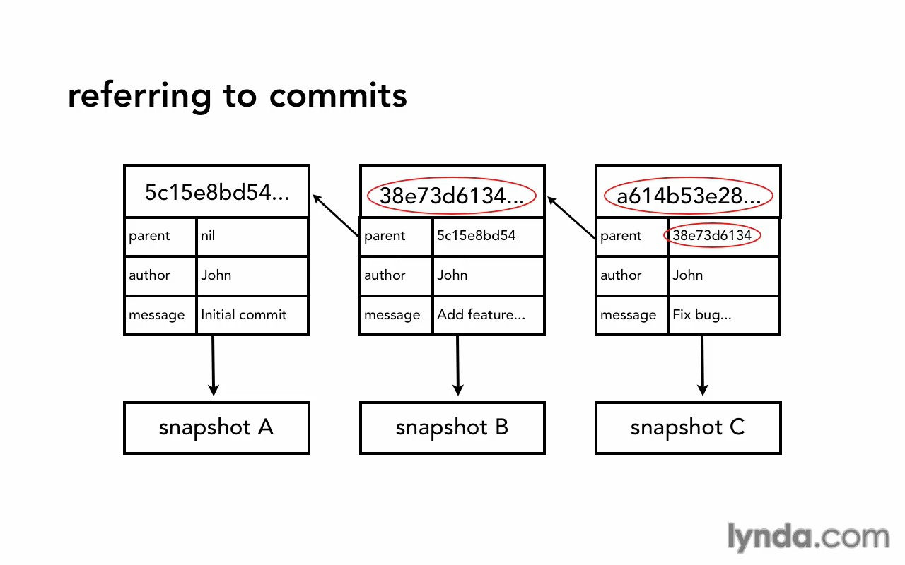
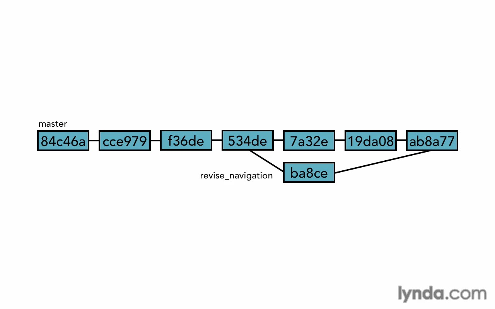
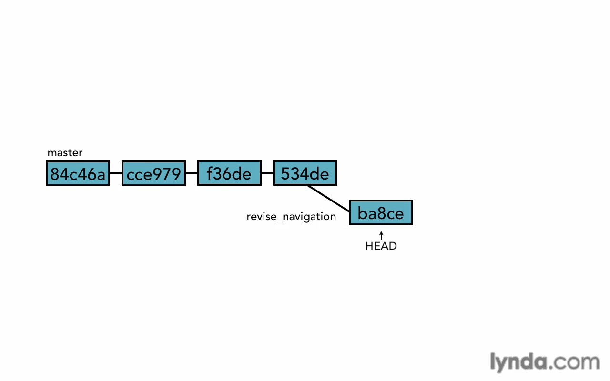
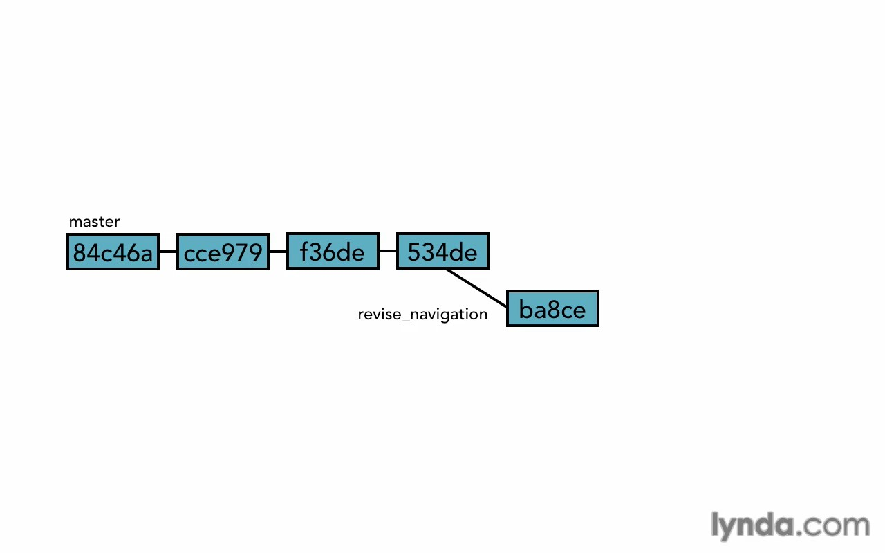
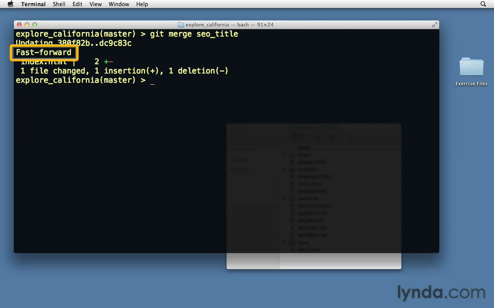

* First chapter (Installing Git)
    * [Git configuration](#git-configuration)
        * [Add/show your confg](#addshow-your-confg)
    * [Git help](#git-help)
* Chapter two (Getting Started)
    * [Git initializing](#git-initializing)
    * [First commit](#first-commit)
    * [Commit message best practices](#commit-message-best-practices)
    * [Git log](#git-log)
* Chapter three (Git Concepts and Architecture)
    * [How git save commits (Architecture)](#how-git-save-commits-architecture)
    * [HEAD pointer](#head-pointer)
* Chapter four (Making Changes to Files)
    * [Adding files](#adding-files)
    * [Viewing changes](#viewing-changes)
        * Look also at [Comparing commits](#comparing-commits)
    * [Deleting files](#deleting-files)
    * [Moving / renaming files](#moving--renaming-files)
* Chapter five (Using Git with a Real Project)
    * [Good tips when using git diff command](#good-tips-when-using-git-diff-command)
    * [Shortcut for add and commit in the same step](#shortcut-for-add-all-and-commit-in-the-same-step)
* Chapter six (Undoing Changes)
    * [Undo working dir](#undo-working-dir)
    * [Unstaging files](#unstaging-files)
    * [Amend commits](#amend-commits)
    * [Retrieving old versions](#retrieving-old-versions)
    * [Using reset](#using-reset)
    * [Remove untracked](#remove-untracked)
* Chapter seven (Ignoring Files)
    * [Git ignore](#git-ignore)
    * [Global ignoring](#global-ignoring)
    * [Ignore tracked](#ignore-tracked)
    * [Track empty dirs](#track-empty-dirs)
* Chapter eight (Navigating the Commit Tree)
    * [Reference commits](#reference-commits)
    * [Tree listings](#tree-listings)
    * [Commit log](#commit-log)
    * [View commits](#view-commits)
    * [Comparing commits](#comparing-commits)
* Chapter nine (Branching)
    * [Branch overview](#branch-overview)
    * [Create branch](#create-branch)
    * [Switch branches](#switch-branches)
    * [Uncommitted changes](#uncommitted-changes)
    * [Compare branches](#compare-branches)
    * [Rename branch](#rename-branch)
    * [Delete branch](#delete-branch)
* Chapter ten (Merging Branches)
    * [Merging](#merging)
    * [Fast forward vs real](#fast-forward-vs-real)
    * [Merge conflicts](#merge-conflicts)
* Chapter eleven (Stashing Changes)
    * [Saving in stash](#saving-in-stash)
    * [Viewing stash](#viewing-stash)
    * [Retrieve from stash](#retrieve-from-stash)
    * [Delete stash](#delete-stash)


# Installing Git

## Git configuration:
System
```bash
git config --system
```
User
```bash
git config --global
```
Project
```bash
git config
```
## Add/show your confg:
```bash
git config --global user.name "bla bla bla"
git config --global user.email "bla@bla.bla"
```
To show current confgs.
```bash
git config --list
Or
git config user.name
```
To show messages on specific editor.
```bash
git config --global core.editor "bla bla bla"
```
To color terminal.
```bash
git config --global color.ui true
```
## Git help:
```bash
git help
```
To show specific command manual.
```bash
git help log
```

# Getting Started

## Git initializing
```bash
git init
```
## First commit
First you need add all changes you did on stage area.
```bash
# . for current directory.
git add .
```
After that commit them.
```bash
# -m for massage.
git commit -m "My first commit"
```
HOORAY your first commit is done.

## Commit Message best practices
Those are some point you need to be aware about them when you write a message.
* short single-line summary (less 50 characters).
* optionally followed by a blank line and more complete description.
* keep each line to less then 72 characters.
* write commit message in present tense.
* bullet points are usually asterisks or hyphens.
* can add (ticket tracking numbers) from bugs or support requests.
    * [css,js] for file type.
    * [bugFix] when you fix a bugs.
    * [#49443] ticket number for bugs or support.
Example for a good commit message.


## Git log
To show all log commits.
```bash
git log
```
To show last two or there or last commits.
```bash
git log -n 2 # for last two commit
```
Show commits from specific date.
```bash
git log --since=2018-05-10
```
Show commits before specific date.
```bash
git log --until=2018-05-10
```
And we can merge between them to get commits in specific period.
Also we can use not only date but phrases like
```bash
git log --until="2 weeks ago"
# or
git log --until=2.weeks
# or
git log --until=2.days
```
Show commits for specific author (you can put only part form his name).
```bash
git log --author="bla"
```
Log by searching using regular expression on commit messages.
```bash
git log --grep="bla bla bla"
```
To list commits in one line use following
```bash
git log --oneline
# that's will return small SHA
git log --format=oneline
# that's will return long SHA
```
you can get range of commits by put first point SHA and last point SHA
```bash
git log 42423..23443 --oneline
# .. for go forward to up.
```
You can ask it for log changes in specific file
```bash
git log file_name.txt
# or from specific commit
git log 324234.. file_name.txt
```
To see what happen in each commit with log use -p option
```bash
git log -p
# you can mix them
git log -p 324234.. file_name.txt
# that's will show all log and what happened in it form specific commit and up for specific file.
```
To show summary for each commit
```bash
git log --stat --summary
```
We can use --format to show different informations like
```bash
git log --format=raw
# that's will show raw information that store in git.
git log --format=email
# to show log as email format.
# you can messing up with format option.
```
One important command is log commits graph
```bash
git log --graph
```
We can show log in nice way like
```bash
git log --oneline --graph --all --decorate
```

# Git Concepts and Architecture

## How git save commits (Architecture)


## HEAD pointer
Pointer to "tip" of current branch in repo.

Git save HEAD pointer on .git/HEAD file, and from this file it'll navigate you to the commit it refer on it.

# Making Changes to Files

## Adding files
* Any new files git doesn't know about them, will show them in (Untracked files).
```bash
git add file_name.txt
# or
git add . # dot for current directory
# or
git add file_* # * for any files begin with (file_)
```

## Viewing changes
We can compare between the changes in working directory and last changes in stage & repo.
```bash
git diff
```
Or changes on specific file.
```bash
git diff file_name.txt
```
For show changes on the stage area against repo use following command.
```bash
git diff --staged
```
## Deleting files
Just press delete or drag and drop files on trash :), To add removed file to stage area use following command.
```bash
git rm deleted_file.txt
```
> With new git versions you can simply use (git add).
OR short the holy steps by only use (git rm) to do both things delete the files and put them in stage area.

## Moving / renaming files
We can renaming any file by regular operation, rename the file with OS. And it'll show on git there's a file deleted and another added.
Or we can use git to short the process.
```bash
git mv old_file_name.txt new_file_name.txt
```
Same thing for moving files.
> On moving case it'll show moving process as a renaming process!

# Using Git with a Real Project

## Good tips when using git diff command
* You can do the (word wrap) on a terminal when you use (git diff) command by following:

    Press minus then shift+s then return key, do the same for remove word wrap.
* You can only colored the changes words by following:
```bash
git diff --color-words file_name.txt
```

## Shortcut for add all and commit in the same step
```bash
git commit -am "bla bla bla"
```

# Undoing Changes

## Undo working dir
To undo things we did in our working dir simply to following:
```bash
git checkout -- file_name.txt
# -- for I checkout files not branches.
# or dir like current dir
git checkout -- .
# or by dir name
git checkout -- dir_name
```
But if there a branch with same name of dir it'll checkout the branch, for that, the best practice is put -- before file or dir we want to undo it.
```bash
git checkout -- file_name.txt
```
## Unstaging files
We can unstaging files to working dir by following:
```bash
git reset HEAD file_name.txt
```
## Amend commits
If we wanna amend to commit in the repo, we have a problem!, that commit SHA is use to be parent to another commit, and if we change that commit is SHA will change too and the next commit to it will be broken. And so on!.


And also it'll change next commit SHA because git use all data to generate SHA, if we change anything the SHA will change too.



But last commit because nothing depend on it we can amend it by using amend option.
```bash
git commit --amend -m "bla bla bla"
```
That's will (merge) amend the new changes to the last commit in our repo.

> You can use this command if you wanna change commit message.

## Retrieving old versions
If we wanna change/remove commit in the middle of other commits (undo), that we can't use amend option with it (check the previous section).

First way, we gonna checkout the commit's parent for get the old state we wanna undo to it, or the commit itself for change small pieces or something.
```bash
git checkout 4d2333dsqw -- file_name.txt
# that's a parent commit/commit SHA we wanna change to it 4d2333dsqw
# -- for current branch
# file_name.txt the file we wanna change it form the commit.
```
Then we'll find it on our staging area, from this point we can do what we want like reset HEAD to move it to working dir, and checkout it form working dir to remove it totally, or change thing and commit it again, it's up for you for what you want.

> The best practice if you gonna commit other changes again, that you put commit SHA in the new commit message to keep others know that's a retrieving commit.

And for undo the commit totally, git provide command for that.
```bash
git revert 4d2333dsqw
```
Now it'll do the opposite of this commit. if something added it'll be deleted if something delete it'll be added and so on.

## Using reset
Git reset it like cassette recorder, you'll move the HEAD to a point and star record form it.
It's a powerful tool you must use it wisely : )

There's a three different options to do that:

1- --soft (It doesn't change staging index or working dir).

2- --mixed the default option (Changes staging index to match repo & doesn't change working dir).

3- --hard (Changes staging index and working dir to match repo).

* Reset soft
```bash
git reset --soft 324kkdf323
# 324kkdf323 the SHA for commit we wanna reset to it.
```
Now the HEAD will reset to the commit we write its SHA above, but nothing in our staging or working dir will change, all staff will be there and that's the safest choose.

> Please note the commits content after reset your head will find them in staging area.

* Reset mixed
```bash
git reset --mixed 324kkdf323
```
Everything will be like soft choose but the different here, you will find all staff on working dir only, nothing on staging area.

* Reset hard
If you wanna lose everything after specific commit then use reset hard.
```bash
git reset --hard 324kkdf323
```
Now git will move HEAD to commit you want and you'll find you staging and working dir clean.

> If you wanna back again even after use reset hard, that's possible but you must remember SHA for the commit to reset it.

## Remove untracked
If we want remove untracked file all on one we can use following command:
```bash
git clean -nf
# -n for show what file will remove
# -f to force remove 
# the both will delete all untracked files.
```

# Ignoring Files

## Git ignore
* To ignore some files we won't track them, we need to create (.gitignore) file.
* .gitignore Will not ignore the files already tracked, the only new one.
* We can use basic regular expression to ignore files like \*,?,[0-9]...etc.
* We can also negate expression with !, for example ignore all php file (\*.php) but not index.php (!index.php).
* Ignore dir by put / in the end.
* Put comments by using # symbol.

## Global ignoring
You can choose which files you want ignore anywhere by following:
```bash
git config --global core.excludesfile ~/.gitignore_global
```
Now put whatever you want inside gitignore_global file and it'll be ignored everywhere.

## Ignore tracked
Git not ignore tracked files, so we need to tell git to stop track those files, we have some scenarios here:
* Delete those files so git will not track them anymore.
```bash
git rm file_name.txt
```
* But what if we don't want delete those files, just we want untrack them!, now we need one more option.
```bash
git rm --cached file_name.txt
```
That command will remove files from staging index so git will ignore them in the future.

> After using last command you will find those files staged as deleted files, that's ok, that's how git stop tracking files, and also other contributors will understand that git delete those files so it'll not track them anymore. But all files on working dir and repo will still there.

## Track empty dirs
Git is designed to be a file-tracking system, so it'll not track those dirs they not have any files at all.

If you want git track empty dirs you need cheat on it by put any kind of files inside it to let git track this dir, and (.gitkeep) makes the trick.

# Navigating the Commit Tree

## Reference commits
Now we need to know a new concept on git called Tree-ish, we know about tree, tree is structure file in git repo.

Tree-ish is something that references part of the tree, it like your directory in your file system.

In another word Tree-ish is a reference for a commit.

Tree-ish can be:
* Full SHA-1 hash.
* Short SHA-1 hash.
* HEAD pointer.
* Branch reference, tag reference.
* Ancestry
    * parent commit
        - HEAD^, 4rt283ff^, master^
        - HEAD~1, HEAD~
    * grandparent commit
        - HEAD^^, 4rt283ff^^, master^^
        - HEAD~2
    * great-grandparent commit
        - HEAD^^^, 4rt283ff^^^, master^^^
        - HEAD~3

## Tree listings
In Linux file system you can use command to list dir content (dir tree)
```bash
ls -al
```
And also you can use Tree-ish to do same thing, list commit content
```bash
git ls-tree HEAD
# Now I use HEAD to show HEAD list, you can use whatever you want to target the point you want.
git ls-tree HEAD dir/
# We can list specific dir content from the snapshot.
git ls-tree HEAD^ dir/
# Now we can compare between current snapshot (above command) and previous snapshot (current command).
```
When you list commit content you will find two kind of content blob and tree, blob is a file and tree is a dir, and every file or dir has a unique SHA.

## View commits
To show commit changes
```bash
git show 214ds33
```
We can show short format
```bash
git show --format=oneline HEAD
```
Show option can do the same like ls-tree command, it can show blob, tree, tag or commit content.
```bash
git show 211rr323
# this 211rr323 SHA can be for dir or file
# you can get this SHA by use ls-tree command
```

## Comparing commits
We can compare between working dir and old commit.
```bash
git diff 211rr323
```
And we can be more specific and show difference on one file.
```bash
git diff 211rr323 file_name.txt
```
You can compare between two commits.
```bash
git diff 211rr323..3432fddsw
# for specific file
git diff 211rr323..3432fddsw file_name.txt
```
We can use also Tree-ish instead of commit SHA.

We can use several options with diff command.

For example we can see a brief about the changes between HEAD and old commit.
```bash
git diff --stat --summary 211rr323..HEAD
```
And we can show the deferent and ignore if someone change one white space to two spaces.
```bash
git diff --ignore-space-change 211rr323..HEAD
# shortcut
git diff -b 211rr323..HEAD
```
Or ignore all white spaces.
```bash
git diff --ignore-all-space 211rr323..HEAD
# shortcut
git diff -w 211rr323..HEAD
```

# Branching

## Branch overview
Branch is a great feature that allow you to try new ideas without any fear. It isolate those attempts from your master work and if they not working as you expected for any reasons you can get rid of them without headache for revert or delete. And if they work as expectation you can merge them with your master work.



HEAD will always point for last commit in current branch you checked-out.




## Create branch
To show branches on local machine.
```bash
git branch
```
To create new branch called (new_branch)
```bash
git branch new_branch
```

## Switch branches
To switch between branches.
```bash
git checkout new_branch
```
You can create and switch to new branch in same step.
```bash
git checkout -b new_branch
```

## Uncommitted changes
To switch between branches your working dir must be clean or mostly clean.

Because git will gives you an error if you try to checkout and your working dir not clean, because git will lose all those changes if it not giving you that error, in this case you have three options:<br>
1- Checkout your changes and lose them, so git can switch safely.<br>
2- Commit those changes, so you keep them on git.<br>
3- Stash them, to return for them later.

## Compare branches
To show the difference between two branches
```bash
git diff master..new_branch
# to show the difference between master and new_branch
```
You can use all options with normal diff here.

We can also use Tree-ish
```bash
git diff --color-words master..new_branch^
# to show the difference between master and previous HEAD commit on new_branch
```
To show all branches completely merged with our current branch
```bash
git branch --merged
# any branch will appear that's mean current branch contain all its commits.
```

## Rename branch
To rename branches we use move option.
```bash
git branch -m old_branch_name new_branch_name
# we can use --move or for shorten -m.
```

## Delete branch
To delete branch we use delete option.
```bash
git branch -d deleted_branch
# we can use --delete or for shorten -d.
```
* You can't delete the branch you checkout (current one), you must checkout to other branch and after that delete that branch.
* If you add some commits to branch and you wanna delete it, git will warring you to merge it first or use <code>git branch -D deleted_branch</code> to make sure you mean it.

# Merging Branches

## Merging
Now after we test our feature and it succeed we need to **mrege** it. <br>
Checkout the branch you want merge **to** in this case master branch and type.
```bash
git merge feature_branch
```

## Fast forward vs real
**Fast forward merge** <br>
If you add some new commits on your feature branch and It be forward your master branch, and your master branch didn't move, in this case the fast forward merge will happened, it only takes a new commits and put master HEAD pointer on last commit and that's it!.




> in fast forward merge it'll not create a merge commit, if you need a merge commit use <code>--no-ff</code> option this commit mean (don't do the fast forward) and opposite this command <code>--ff-only</code> and that's mean (do the fast forward if it possible and if it not cancel the merge operation).

**The real merge** <br>
If your master branch has any commits after you created your feature branch, now it'll do the real merge. It will create a new commit with merge details.

And there types from real merge, one of them is **recursive strategy**, the recursive strategy is exactly what we read above in simple way.

> note: recursive strategy apply if there's no conflict.

## Merge conflicts
If we make a changes in same line on both branches, now git will stop merging and ask us as what it should do in this situation, and that what we called (Merge conflict).

In case of merge conflict we have 3 chooses:
* Abort merge.
* Solve the conflict manually.
* Use a merge tool.

**Abort merge**
```bash
git merge --abort
```
Every thing will back like before.

**Solve the conflict manually** <br>
In this case you need to read the code and decide what should do after that just commit the new changes to succeed the merge operation.
```bash
git commit
# notice: commit without the message, to put standard default git message.
```

**Use a merge tool** <br>
Type
```bash
git mergetool --tool=bla bla bla
# to show list of git tools, type
git mergetool
# and hit tab
```

To **reduce conflicts** here's some tips.


# Stashing Changes

## Saving in stash
Stash is a place we can save files in it temporarily, without need to commit them. <br>
You can save things in the stash and move free between branches.
```bash
git stash save "bla bla bla"
```
In this way we can save files inside the stash.

## Viewing stash
To show what in the stash.
```bash
git stash list
```
And to show details.
```bash
git stash show stash@{x}
# stash@{x} is the ID for stash number o will increase every time you put things in the stash.
```
And to show what changed we need to add <code>-p</code> option.
```bash
git stash show -p stash@{x}
```

## Retrieve from stash
To get what you put in the stash write.
```bash
git stash pop stash@{x}
# or
git stash apply stash@{x}
```
The differences between both is pop will get changing out from the stash and delete them after that from the stash. <br>
Apply will only get them out of the stage.

Or you can write them like
```bash
git stash pop
# and I'll take stash@{0}.
```
And like merge it can show a conflict, and you will need to solve it.

## Delete stash
To delete from the stash
```bash
git stash drop stash@{x}
```
Or for delete everything in the stash
```bash
git stash clear
```