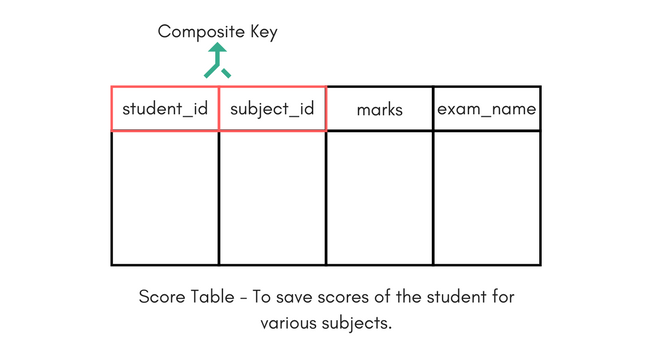

# Database Keys

* [Key Definition](#key-definition)
* [Super Key](#super-key)
* [Candidate Key](#candidate-key)
* [Primary Key](#primary-key)
* [Composite/Compound Key](#compositecompound-key)
* [Unique Key](#unique-key)
* [Foreign Key](#foreign-key)
* [Alternate key](#alternate-key)

### Key Definition
A key is a single or combination of multiple fields in a table. Its is used to **fetch or retrieve records/data-rows** from data table according to the condition/requirement. Keys are also used to **create relationship** among different database tables or views.

### Super Key
Super key is a set of one or more than one keys that can be used to identify a record uniquely in a table.

Example : Primary key, Unique key, Alternate key are subset of Super Keys.

### Candidate Key
A Candidate Key is a set of one or more fields/columns that can identify a record uniquely in a table. There can be multiple Candidate Keys in one table. Each Candidate Key can work as Primary Key.

Example: In previous diagram `ID`, `RollNo` and `EnrollNo` are Candidate Keys since all these three fields can be work as Primary Key.

### Primary Key
Primary key is a set of one or more fields/columns of a table that uniquely identify a record in database table. It can *not accept null*, *duplicate values*. **Only one Candidate Key can be Primary Key**.

### Composite/Compound Key
Composite Key is a combination of more than one fields/columns of a table. It can be a Candidate key, Primary key.

### Unique Key
Uniquekey is a set of one or more fields/columns of a table that uniquely identify a record in database table. It is like Primary key but it can **accept only one null value** and it can not have duplicate values.

### Foreign Key
Foreign Key is a field in database table that is Primary key in another table. It can accept multiple null, duplicate values.

### Alternate key
A Alternate key is a key that can be work as a primary key. Basically it is a candidate key that currently is not primary key.
